# DD-Lab's Plotter 

## Indhold
- [Quickstart](https://github.com/DDlabAU/plotter/blob/master/README.md#quickstart)
  - [Installer software og driver til Axidraw](https://github.com/DDlabAU/plotter/blob/master/README.md#installer-software-og-driver-til-axidraw) 
  - [Hardware setup](https://github.com/DDlabAU/plotter/blob/master/README.md#hardware-setup)
- [Udviddet brug af plotter](https://github.com/DDlabAU/plotter/blob/master/README.md#udviddet-brug-af-plotter)

## Quickstart

### Installer software og driver til Axidraw

- Download software [Her](axidraw.com/sw).

  - Software indeholder Inkscape + udvidelser der bruges til at styre AxiDraw fra inkscape.

- Når du har downloadet inkscape og driver skal du genstarte din laptop.

- Nu skal du bestemme din arbejdsflade.

  - Inde i Inkscape, gå til file/document properties.

    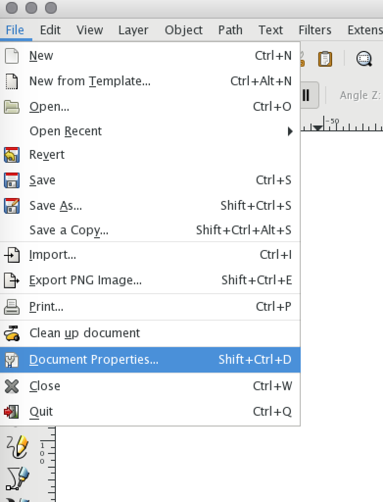

    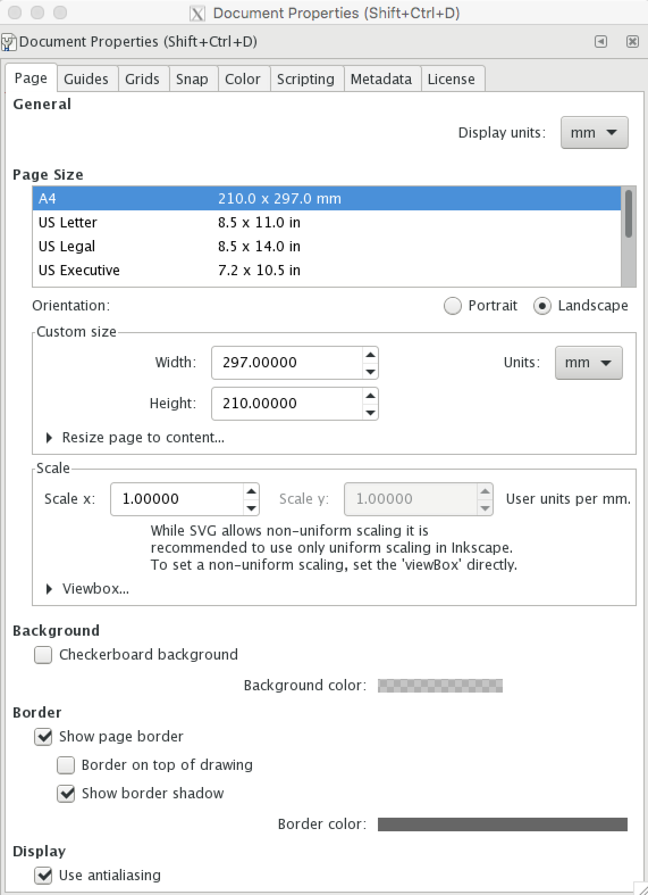

  - Her indtilles størrelsen og om papiret er i "portrait" eller "landscape" i forhold til plotteren.

- Nu kan du designe din figur/tekst.

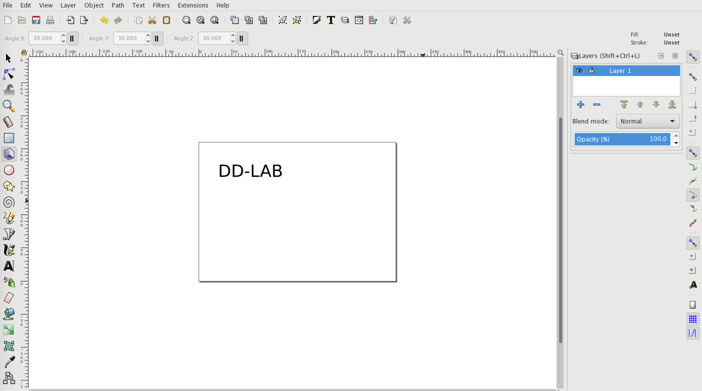

- Når du har lavet dit design skal du konverterer dine figurer til paths.

  - Marker din figur.
  - Gå til path/object to path.

  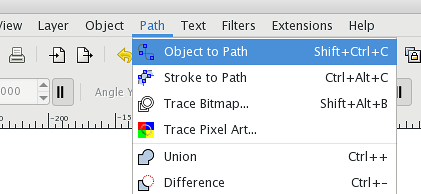

- Nu er din figur klar til at blive plottet, og plotterens hardware kan klargøres.

## Hardware setup

- Først skal "huset", hvor pennen monteres, flyttes hen til "Home-Position Label" positionen.

  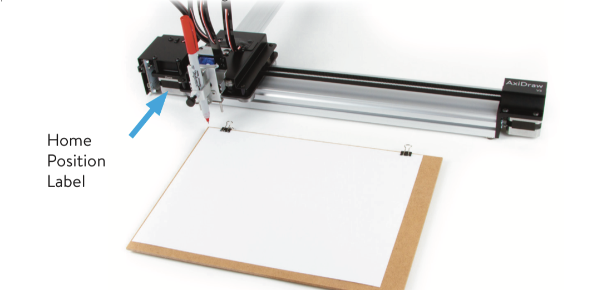

**Vigtigt!!!**: Hvis huset ikke nemt kan flyttes til "Home-corner"-position, kan X/Y - motorene slukkes ved at gå ind i utilities AxiDraw Utilities/ Disable XY motors.
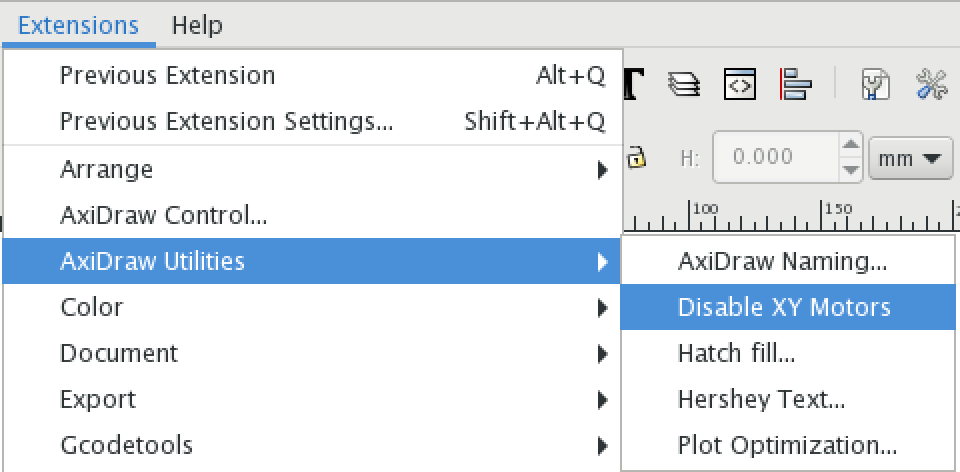

- Tilslut axidraw til strøm.

  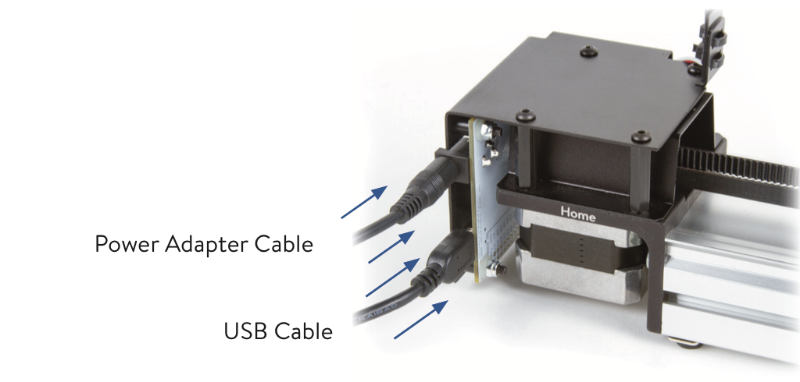

- Tjek om axidraw er tilsluttet korrekt.

  - Gå til Extensions/AxiDraw Control.

    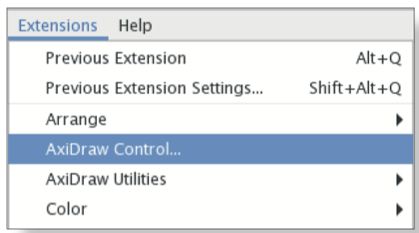

  - Gå til "setup"-tabben og aktiver "Toggle pen between UP, Down." og tryk "Apply".

    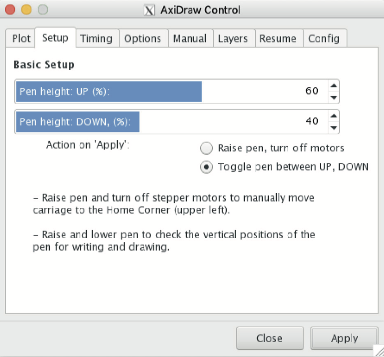

    - Hvis der ikke er noget der bevæger sig, så tjek om der stadig er strøm tilsluttet axidraw.

  - Indsæt herefter noget at skrive med i Axidraw.

    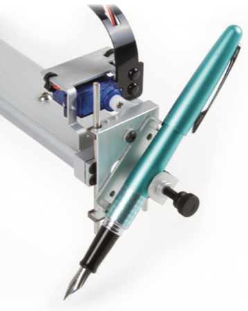

    - Hver opmærksom på ikke at spænde spænde-skruen for hårdt fast.

    - Placer skriveværktøjet ca. 3-6mm over papiret.

      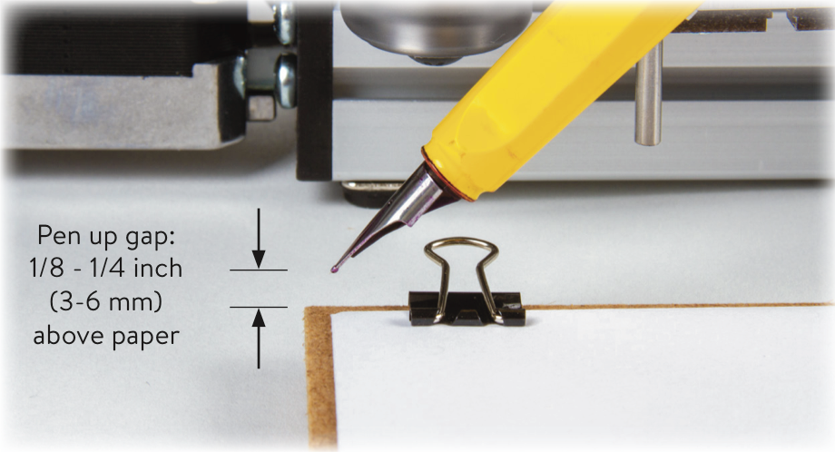

    - Placer fastspændte papir under skriveren, som anvist på ovenstående billede.

    - Gå til Extensions/AxiDraw Control og ind i "plot"-tabben.

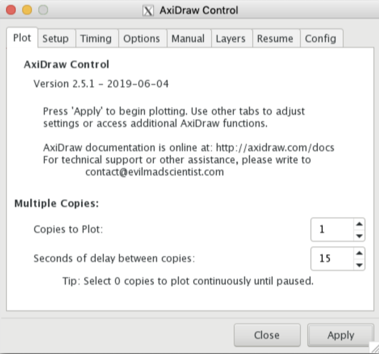

- Tryk så "**Apply**" for at plotte din figur.

___________

## Udviddet brug af Plotter

DISC: (Udviddet brug af plotter vil løbende blive opdateret med flere måder at bruge plotteren på).

- Der findes andre måder hvorpå man kan arbejde/kontrollere AxiDraw plotteren.
  - [CLi-API ](https://axidraw.com/doc/cli_api)
  - [Python-API](https://axidraw.com/doc/py_api)
- Det er også muligt at interface direkte med AxiDraw's EBB motor control board.
  - [EBB Motor control board command protocol](http://evil-mad.github.io/EggBot/ebb.html)
  
  

**se mere om hvordan du kan bruge plotteren med python på [plotter-udviddet](https://github.com/DDlabAU/plotter-udviddet) på DD-lab's github.**

## Source

- https://axidraw.com/
- https://axidraw.com/sw
- https://axidraw.com/docs
- https://wiki.evilmadscientist.com/AxiDraw_User_Guide
- https://github.com/matthewalangreen/kinect-axidraw
- https://www.youtube.com/watch?v=j3yH6FfD_Wk (Pip install)
- https://www.youtube.com/watch?v=5lsAoQ8lF4M (Script package til python)
- https://github.com/piksels-and-lines-orchestra/inkscape (inkscape extension)
- https://courses.ideate.cmu.edu/60-428/s2018/ref/text/tut/max-osc-python.html (Max-osc-python)
