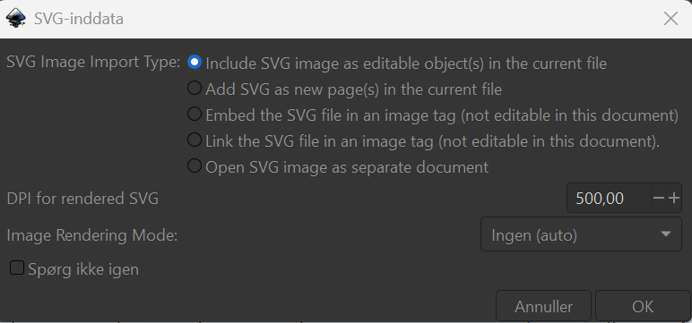
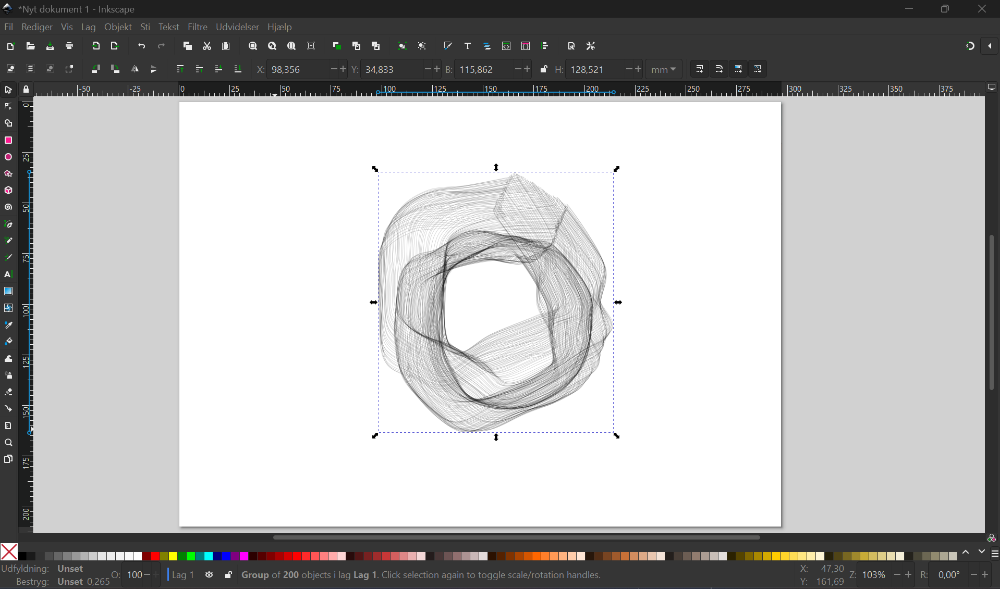

# DD-Lab's Plotter

Plotteren er en skrive eller tegne maskine, som kan bruge næsten alle slags skriveredskaber og på mange forskellige overflader.

##  📑 Indhold

- [Quickstart](https://github.com/DDlabAU/plotter/blob/master/README.md#quickstart)
  - [Installer software og driver til Axidraw](https://github.com/DDlabAU/plotter/blob/master/README.md#installer-software-og-driver-til-axidraw)
  - [Hardware setup](https://github.com/DDlabAU/plotter/blob/master/README.md#hardware-setup)
- [Plot med P5](https://github.com/DDlabAU/plotter/blob/master/README.md#plot-med-p5)
- [Udviddet brug af plotter](https://github.com/DDlabAU/plotter/blob/master/README.md#udviddet-brug-af-plotter)

## ⚡ Quickstart

###  💻 Installer software og driver til Axidraw

- Download software [Her](https://wiki.evilmadscientist.com/Axidraw_Software_Installation).

  - Software indeholder tegneprogrammet Inkscape + Udvidelser der bruges til at styre AxiDraw fra inkscape.

- Når du har downloadet inkscape og driver skal du genstarte din laptop.

- Start Inkscape op (for første gang: tryk igennem start-up menuen)

- Nu skal du bestemme din arbejdsflade.

  - Inde i Inkscape, gå til file/document properties.

    

    

  - Her indtilles størrelsen og om papiret er i "portrait" eller "landscape" i forhold til plotteren (forestil dig, at plotteren ligger i toppen af arbejdsfladen).

- Nu kan du designe din figur/tekst.

- Når du har lavet dit design skal du konverterer dine figurer til paths.

  - Marker din figur.
  - Gå til path/object to path.

  

- Nu er din figur klar til at blive plottet, og plotterens hardware kan klargøres.

###  🔧 Hardware setup

- Først skal "huset", hvor pennen monteres, skubbes hen til "Home-Position Label" positionen.

  

**Vigtigt!!!**: Hvis huset ikke nemt kan skubbes til "Home-corner"-position, kan X/Y - motorene slukkes ved at gå ind i utilities AxiDraw Utilities/ Disable XY motors.

- Tilslut axidraw til strøm, og USB-kablet i computeren.

  

- Tjek om axidraw er tilsluttet korrekt.

  - Gå til Extensions/AxiDraw Control.

    

  - Gå til "setup"-tabben og aktiver "Toggle pen between UP, Down." og tryk "Apply". Så skulle maskinen gerne bevæge hovedet enten op eller ned.

    

    - Hvis der ikke er noget der bevæger sig, så tjek om der stadig er strøm tilsluttet axidraw.

  - Indsæt herefter et skriveredskab i Axidraw. Den kan enten positioneres lodret eller skrå alt afhængig af skrivereskabet.

    

    - Vær opmærksom på ikke at spænde spænde-skruen for hårdt fast.

    - Placer skriveredskabet ca. 3-6mm over papiret.

      

    - Placer fastspændte papir under skriveredskabet, som anvist på ovenstående billede (Dér hvor skriveredskabet starter er 0-punktet for tegningen).

    - Gå til Extensions/AxiDraw Control og ind i "plot"-tabben.

- Tryk så "**Apply**" for at plotte din figur.

---

###  🎨 Plot med P5

Dette eksempel tager udgangspunkt i en modificeret udgave af kunstværket ***P_2_2_3_02***, som er publiceret i bogen *Generative Design* af *Benedikt Gross*, *Hartmut Bohnacker*, *Julia Laub* og *Claudius Lazzeroni*. Du kan finde kunstværket [her](http://www.generative-gestaltung.de/2/) samt lignende værker. 

  

#### 📥 Download kodefilerne

- **Opret en mappe til projektet:**
  - Opret en mappe på din computer kaldet _Abstract Pattern_.
  
- **Download koden:**
  - Gå til _Creative coding with P5_ → _Abstract Pattern_.
  - Download alle filerne og placer dem i den mappe, du lige har oprettet.
    
- **Åbn mappen i Visual Studio Code:**
  - Gå til **File** → **Open Folder** → **Abstract Pattern**.

- **Kør koden:**
  - Klik på **Go Live** for at åbne koden i din browser.
  - Når koden er færdig, gemmes billedet automatisk som en **PNG** eller **SVG**, afhængigt af hvad du har valgt i koden.

---

#### 🖊️ Plot koden

- **Åbn Inkscape:**
  - Følg instrukserne under Quickstart for at opsætte programmet korrekt.

- **Importer det gemte billede:**
  - Gå til **File** → **Import** → _pattern.svg_.
  - Vælg _"Include SVG image as editable object in the current file"_ og tryk **OK**.

  

- **Konverter filen til en sti:**
  - Marker dit design.
  - Gå til **Path** → **Object to Path**.

  

- Billedet er nu klar til at blive plottet :)

---

##  🚀 Udviddet brug af Plotter

DISC: (Udviddet brug af plotter vil løbende blive opdateret med flere måder at bruge plotteren på).

- Der findes andre måder hvorpå man kan arbejde/kontrollere AxiDraw plotteren.
  - [CLi-API ](https://axidraw.com/doc/cli_api)
  - [Python-API](https://axidraw.com/doc/py_api)
- Det er også muligt at interface direkte med AxiDraw's EBB motor control board.

  - [EBB Motor control board command protocol](http://evil-mad.github.io/EggBot/ebb.html)

  

**se mere om hvordan du kan bruge plotteren med python på [plotter-udviddet](https://github.com/DDlabAU/plotter/tree/master/Plotter-udviddet) på DD-lab's github.**

Det er også muligt at omdanne et billede til en vektor baseret linje-tegning plotterne kan finde ud af at læse. Her kan man bruge det gratis værktøj https://mitxela.com/plotterfun/. Hvor du kan uploade et billede og indstille hvor meget afstand du vil have mellem linjerne, og hvor detaljeret den skal være. Der er mulighed for at downloade din tegning ned som en svg-fil, som du herefter kan åbne op i Inkscape og køre plotteren som normalt.

##  📚 Source

- https://axidraw.com/
- https://axidraw.com/sw (Software installation)
- https://axidraw.com/docs (Oversigt over dokumentationer)
- https://wiki.evilmadscientist.com/AxiDraw_User_Guide (Fuld guide til plotteren)
- https://github.com/matthewalangreen/kinect-axidraw (Plot med kinect motion sensor)
- https://www.youtube.com/watch?v=j3yH6FfD_Wk (Pip install)
- https://www.youtube.com/watch?v=5lsAoQ8lF4M (Script package til python)
- https://github.com/piksels-and-lines-orchestra/inkscape (inkscape extension)
- https://courses.ideate.cmu.edu/60-428/s2018/ref/text/tut/max-osc-python.html (Max-osc-python)
